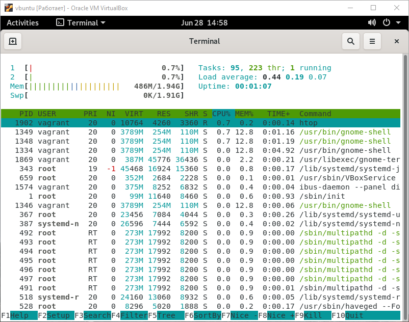

# vagrant-vm
Automate creating the minimal Ubuntu VM and start on Windows.  



## Requirements:
* [Git](https://git-scm.com/download/win)
* [Vagrant](https://www.vagrantup.com/downloads)
* [VirtualBox and Extension Pack](https://www.virtualbox.org/wiki/Downloads)

## Usage:
1. Open `cmd` and clone this repo and go to folder:
```cmd
    git clone https://github.com/vadxx/vagrant-vm.git
    cd vagrant-vm
```

2. Run VM and connect via SSH:
```cmd
    vagrant up
    vagrant ssh
```

3. Some available commands:
```cmd
    vagrant halt
    vagrant reload
```

Note: default user and password is `vagrant`

## Optional
1. Share ssh-config to global SSH (command: `ssh default`):
```cmd
    mkdir %HOMEPATH%\.ssh
    vagrant ssh-config > %HOMEPATH%\.ssh\config
```

2. Destroy your local VM:
```cmd
    vagrant destroy -gf
```

## Helpful sources:
* [Getting started in Vagrant](https://learn.hashicorp.com/collections/vagrant/getting-started)
* [Default env variables in Windows](https://www.computerhope.com/issues/ch000088.htm)


### Based on:
* https://dev.to/vumdao/create-an-ubuntu-20-04-server-using-vagrant-3d2i
